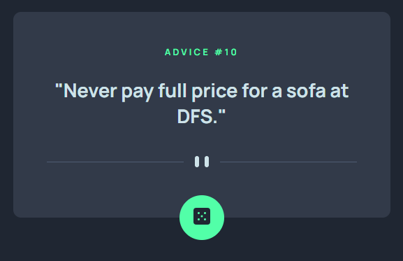

# Frontend Mentor - Advice generator app solution

This is a solution to the [Advice generator app challenge on Frontend Mentor](https://www.frontendmentor.io/challenges/advice-generator-app-QdUG-13db). Frontend Mentor challenges help you improve your coding skills by building realistic projects.

## Table of contents

- [Overview](#overview)
  - [The challenge](#the-challenge)
  - [Screenshot](#screenshot)
  - [Links](#links)
- [My process](#my-process)
  - [Built with](#built-with)
  - [What I learned](#what-i-learned)
  - [Continued development](#continued-development)
  - [Useful resources](#useful-resources)
- [Author](#author)

## Overview

### The challenge

Users should be able to:

- View the optimal layout for the app depending on their device's screen size
- See hover states for all interactive elements on the page
- Generate a new piece of advice by clicking the dice icon

### Screenshot


The desktop layout is a bit wider and the fonts are a tiny bit bigger


The mobile layout is optimized for smaller screen sizes


When you hover over the advice generator button it glows neon green

### Links

- Solution URL: [Frontend Mentor](https://www.frontendmentor.io/solutions/html-scss-flexbox-fetch-MRBpKhMO01)
- Live Site URL: [Github Pages](https://timmartin13-frontend-mentor.github.io/advice-generator/)

## My process

### Built with

- Semantic HTML5 markup
- SCSS
- Flexbox
- Mobile-first workflow
- JavaScript
- Fetch

### What I learned

I am familiar with axios and React so I wanted to try out fetch to connect to the 3rd party API. It was fairly harmless.

To see how you can add code snippets, see below:

```js
const getAdvice = () => {
  fetch(requestUrl)
    .then(response => response.json())
    .then(data => 
      {
        adviceNumber.innerHTML = data.slip.id;
        adviceText.innerHTML = data.slip.advice;
      });
}
```

### Continued development

I am becoming more comfortable with SCSS. It is a lot easier to read and figure out where your code is, even though it is a little bit of a hassle switching between the different scss files all the time.


### Useful resources

I will probably add these two links to every challenge because I am constantly referencing them.

- [Flexbox](https://css-tricks.com/snippets/css/a-guide-to-flexbox/) - I use this for every project
- [SCSS Architecture](https://matthewelsom.com/blog/simple-scss-playbook.html) - I found this to be the resource that I used the most when breaking up my SCSS


## Author

- Website - [My portfolio](https://timmartin13.github.io/react-portfolio/)
- Frontend Mentor - [@TimMartin13](https://www.frontendmentor.io/profile/TimMartin13)
